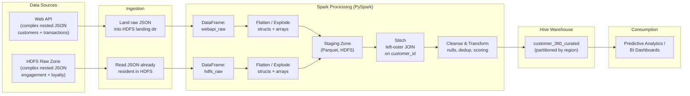
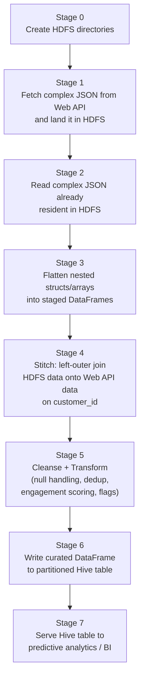
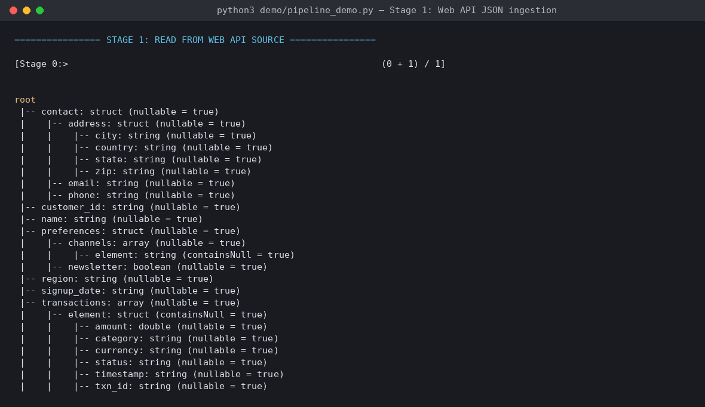
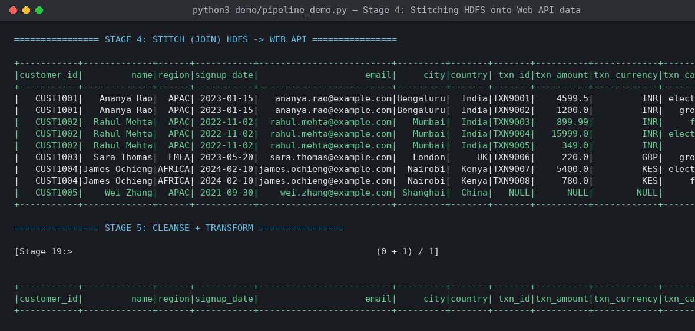
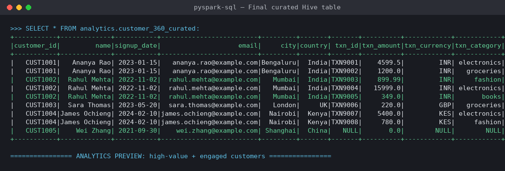
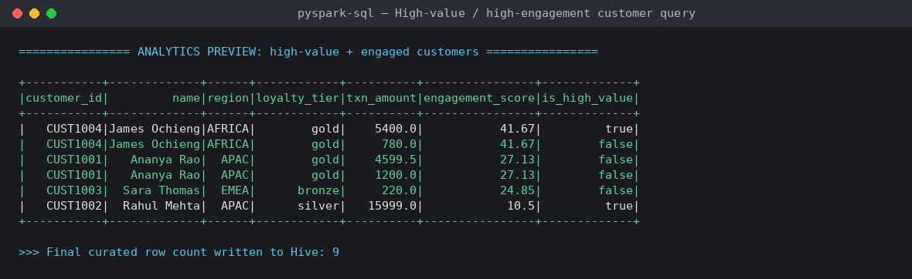

# Spark-Hive: Complex JSON Data Processing

**Multi-source Spark ingestion → HDFS staging → data stitching → Hive analytics table**


---

## 1. Overview

This project ingests **complex, deeply nested JSON** from two independent sources — a **Web API** and **HDFS** — loads it into Spark DataFrames, stages it through multiple transformation zones, **stitches** the two datasets together on `customer_id`, and pushes the curated, analytics-ready result into a **partitioned Hive table** for downstream predictive analytics.

| | |
|---|---|
| **Sources** | REST Web API (customer + transactions) · HDFS raw zone (engagement + loyalty logs) |
| **Processing engine** | Apache Spark (PySpark, DataFrame API) |
| **Storage layers** | HDFS landing → HDFS staging (Parquet) → Hive curated table (Parquet, partitioned) |
| **Output** | `analytics.customer_360_curated` Hive table, partitioned by `region` |
| **Core techniques** | Nested JSON schema inference, `explode`/struct flattening, multi-source join ("stitching"), null-safe cleansing, derived scoring metrics |

---

## 2. Architecture



### Pipeline stage flow



---

## 3. Repository structure

```
spark-hive-json-processing/
├── README.md
├── LICENSE
├── src/
│   ├── pipeline.py                          # Main PySpark job (production code)
│   └── hive_ddl.sql                         # Hive table DDL (landing/raw/curated)
├── demo/
│   ├── pipeline_demo.py                     # Runnable local demo — imports and runs src/pipeline.py
│   ├── make_screenshots.py                  # Generates the screenshots in /screenshots
│   └── requirements.txt
├── data/
│   ├── webapi/customer_transactions.json    # Sample complex nested JSON (Web API source)
│   └── hdfs_raw/customer_engagement.json    # Sample complex nested JSON (HDFS source)
├── diagrams/
│   ├── architecture.mmd
│   └── pipeline_stages.mmd
├── output/
│   └── run_log_clean.txt                    # Full captured console output of a real run
└── screenshots/                             # PNG screenshots of the actual run output
```

---

## 4. Sample input data (complex nested JSON)

**Web API source** — `data/webapi/customer_transactions.json`
```json
{
  "customer_id": "CUST1001",
  "name": "Ananya Rao",
  "region": "APAC",
  "contact": {
    "email": "ananya.rao@example.com",
    "address": { "city": "Bengaluru", "country": "India", "zip": "560001" }
  },
  "transactions": [
    { "txn_id": "TXN9001", "amount": 4599.50, "category": "electronics", "status": "completed" },
    { "txn_id": "TXN9002", "amount": 1200.00, "category": "groceries",   "status": "completed" }
  ],
  "preferences": { "newsletter": true, "channels": ["email", "sms"] }
}
```

**HDFS source** — `data/hdfs_raw/customer_engagement.json`
```json
{
  "customer_id": "CUST1001",
  "sessions": [
    { "session_id": "SESS501", "device": { "type": "mobile", "os": "Android" },
      "duration_sec": 320, "pages_viewed": ["home", "electronics", "product/4599"] }
  ],
  "loyalty": { "tier": "gold", "points": 4200 }
}
```

Both files contain nested **structs**, **arrays of structs**, and **arrays of primitives** — the kind of shape a flat `CREATE TABLE` can't represent, which is why the pipeline explicitly flattens each source before joining.

---

## 5. Core PySpark logic

**Flattening a nested source** (`src/pipeline.py`):
```python
def flatten_webapi_source(df: DataFrame) -> DataFrame:
    """Explode + flatten the WebAPI nested JSON (contact struct, transactions array)."""
    exploded = df.withColumn("txn", F.explode_outer("transactions"))
    return exploded.select(
        F.col("customer_id"), F.col("name"), F.col("region"), F.col("signup_date"),
        F.col("contact.email").alias("email"),
        F.col("contact.address.city").alias("city"),
        F.col("txn.txn_id").alias("txn_id"),
        F.col("txn.amount").alias("txn_amount"),
        F.col("txn.status").alias("txn_status"),
        F.col("preferences.newsletter").alias("newsletter_opt_in"),
    )
```

**Stitching the two sources together:**
```python
def stitch(webapi_flat: DataFrame, hdfs_flat: DataFrame) -> DataFrame:
    """Stitch HDFS engagement/loyalty data onto Web API transaction data."""
    return webapi_flat.join(hdfs_flat, on="customer_id", how="left_outer")
```

**Cleansing, transformation, and derived metrics:**
```python
def cleanse_and_transform(df: DataFrame) -> DataFrame:
    df = df.fillna({"loyalty_tier": "unrated", "txn_status": "unknown"})
    df = df.withColumn("txn_amount", F.coalesce(F.col("txn_amount"), F.lit(0.0)))
    df = df.dropDuplicates(["customer_id", "txn_id"])
    df = df.withColumn(
        "engagement_score",
        F.round((F.col("total_engagement_sec") / 60.0) * (F.col("avg_pages_per_session") + F.lit(1)), 2),
    )
    df = df.withColumn("is_high_value", F.when(F.col("txn_amount") > 5000, True).otherwise(False))
    return df
```

**Writing to Hive (partitioned):**
```python
curated.write.mode("overwrite").format("hive").partitionBy("region").saveAsTable(
    "analytics.customer_360_curated"
)
```

Full source: [`src/pipeline.py`](src/pipeline.py)
Hive DDL: [`src/hive_ddl.sql`](src/hive_ddl.sql)

---

## 6. Curated Hive table schema

| Column | Type | Source | Notes |
|---|---|---|---|
| `customer_id` | STRING | both | join key |
| `name`, `signup_date`, `email`, `city`, `country` | STRING | Web API | flattened from nested `contact` struct |
| `txn_id`, `txn_amount`, `txn_currency`, `txn_category`, `txn_status`, `txn_timestamp` | STRING/DOUBLE | Web API | one row per exploded transaction |
| `newsletter_opt_in` | BOOLEAN | Web API | flattened from `preferences` struct |
| `loyalty_tier`, `loyalty_points` | STRING/INT | HDFS | flattened from `loyalty` struct |
| `total_sessions`, `total_engagement_sec`, `avg_pages_per_session` | BIGINT/DOUBLE | HDFS | aggregated from exploded `sessions` array |
| `engagement_score` | DOUBLE | derived | `(total_engagement_sec / 60) × (avg_pages_per_session + 1)` |
| `is_high_value` | BOOLEAN | derived | `true` when `txn_amount > 5000` |
| `load_timestamp` | TIMESTAMP | derived | pipeline run time |
| `region` | STRING | Web API | **partition column** |

---

## 7. Running it yourself

### Option A — Real cluster (`spark-submit` against YARN + Hive metastore)
```bash
spark-submit \
  --master yarn \
  --deploy-mode cluster \
  src/pipeline.py \
  --webapi-url https://internal-api.example.com/v1/customers/transactions \
  --hdfs-source-dir /data/raw/hdfs_source/customer_engagement \
  --hdfs-landing-dir /data/landing/webapi/customer_transactions \
  --hdfs-staging-dir /data/staging \
  --hive-db analytics \
  --hive-table customer_360_curated \
  --fetch-over-http
```

### Option B — Local demo (no cluster needed, reuses the exact same functions)
```bash
pip install -r demo/requirements.txt
python3 demo/pipeline_demo.py
```

`demo/pipeline_demo.py` doesn't reimplement anything — it imports `flatten_webapi_source`, `flatten_hdfs_source`, `stitch`, and `cleanse_and_transform` directly from `src/pipeline.py` and runs them against local sample files instead of a live API/HDFS, writing the result into a local Hive-compatible catalog via `saveAsTable()`.

---

## 8. Verified run output

The command above was actually executed for this repo. Full raw console output: [`output/run_log_clean.txt`](output/run_log_clean.txt).

**Stage 1 — reading the nested Web API JSON into a DataFrame:**



**Stage 4 — stitching the HDFS engagement data onto the Web API data:**



**Final curated table, as it lands in Hive:**



**Downstream analytics query against the curated Hive table:**



---

## 9. Why this design

| Decision | Reasoning |
|---|---|
| Flatten *before* joining | Nested arrays can't be joined directly; each source is exploded into a row-per-record shape first |
| `left_outer` join, WebAPI → HDFS | Every paying customer should appear even with no engagement data; the reverse isn't true |
| Staging written as Parquet | Columnar, compressed, schema-preserving — cheaper for Spark to re-read than re-parsing JSON |
| Partition Hive table by `region` | Predictive analytics queries in this domain are almost always region-scoped; partition pruning cuts scan cost |
| Null-safe cleansing before scoring | Prevents `NULL` propagation from silently dropping rows out of downstream aggregates |
| Demo imports production functions | `pipeline_demo.py` calls the same `flatten_*`/`stitch`/`cleanse_and_transform` functions as the cluster job, so the verified output reflects real pipeline logic, not a rewritten stand-in |

---

## 10. Tech stack

`Hadoop 3.0` · `HDFS` · `Apache Hive` · `Apache Spark 3.4` · `PySpark / Spark SQL DataFrame API` · `Parquet` · `Python 3.10`

---

## 11. Resume bullet points (reference)

- Built a Spark (PySpark) pipeline to ingest complex, deeply nested JSON from a Web API and HDFS, flattening and staging both sources through multiple transformation zones.
- Designed and implemented HDFS directory structure and Hive tables to support raw, staging, and curated data zones.
- Stitched (joined) HDFS engagement/loyalty data onto Web API transaction data on `customer_id` to build a unified customer view for predictive analytics.
- Implemented cleansing and transformation logic (null handling, deduplication, derived scoring metrics) and loaded curated output into a partitioned Hive table.

---

## License

MIT — see [LICENSE](LICENSE).
